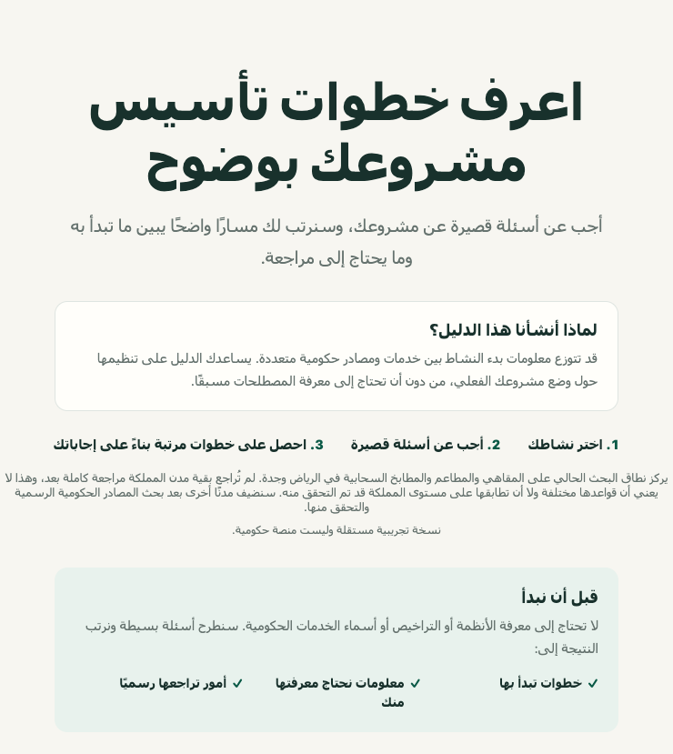
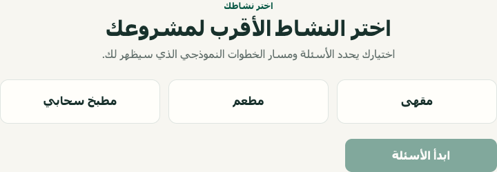
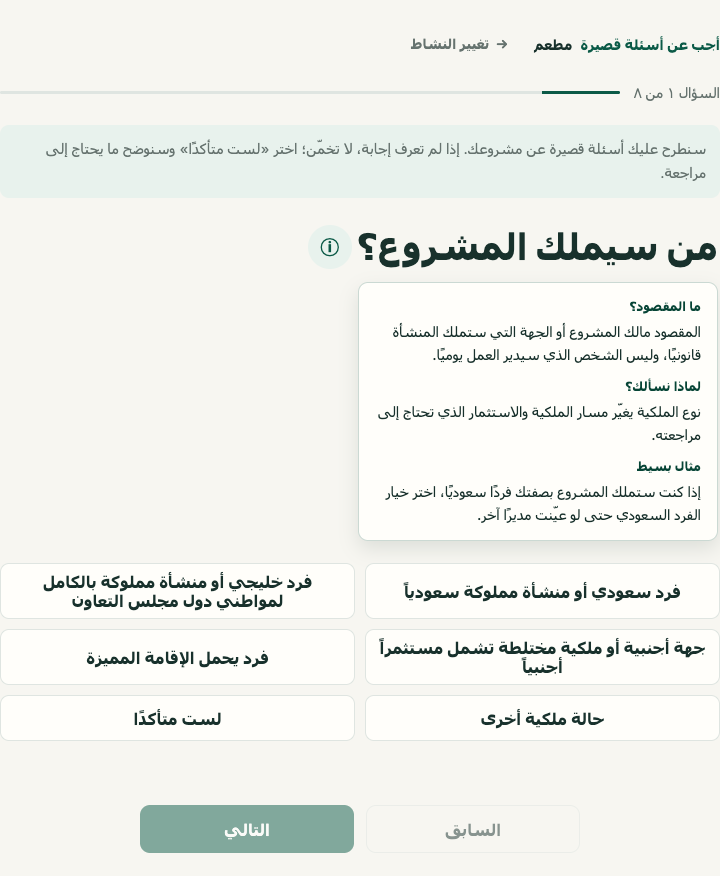
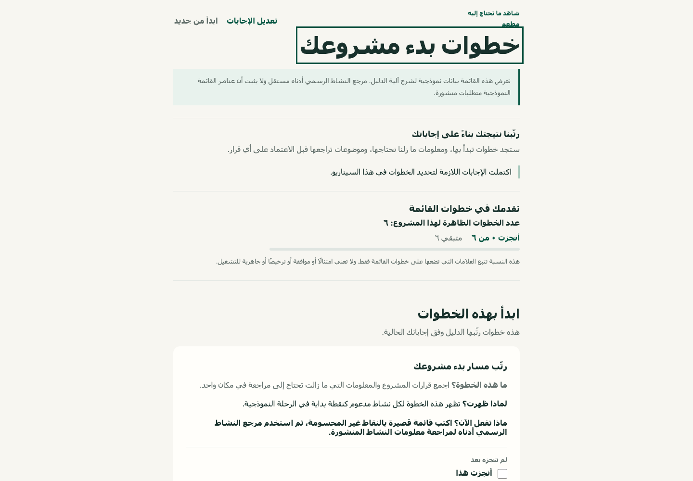
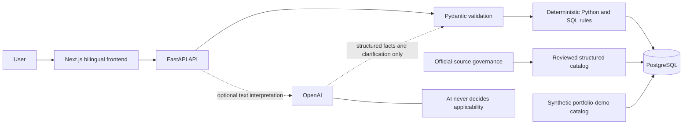

# Saudi Business Launch Navigator

## دليل تأسيس المنشآت في السعودية

An Arabic-first, bilingual business-launch guidance platform for Saudi Arabia.

Business-launch information can span several official services and change with
the business situation. The Navigator turns a short set of structured answers
into validated facts, evaluates deterministic rules, and presents personalized
launch guidance without asking a language model to decide applicability.

**Pilot activities:** coffee shops · restaurants · cloud kitchens<br>
**Research scope:** Riyadh and Jeddah

Other Saudi cities have not yet been fully reviewed. This scope neither assumes
that city rules differ nor claims that nationwide equivalence has been verified;
future expansion follows official-source research and review.

> The public checklist is an explicitly synthetic portfolio dataset. It
> demonstrates the product safely and does not present its sample items as
> Saudi regulatory requirements.

## Live demo

- Frontend: [sbln-portfolio-demo-web.onrender.com](https://sbln-portfolio-demo-web.onrender.com/ar)
- English interface: [sbln-portfolio-demo-web.onrender.com/en](https://sbln-portfolio-demo-web.onrender.com/en)
- API health: [sbln-portfolio-demo-api.onrender.com/health/live](https://sbln-portfolio-demo-api.onrender.com/health/live)

Render's free services may need a short cold-start period before the first
request completes.



## How the experience works

1. Choose the activity closest to the planned business.
2. Answer one plain-language question at a time by choosing the clearest option
   or Not sure.
3. Review steps that follow from the answers.
4. Complete any missing information without the system treating unknown as no.
5. Review separate launch topics and the exact Balady reference for the chosen
   activity.

The guided workflow remains fully usable without an OpenAI API key. Optional AI
can structure a user's business description and explain an existing result; it
cannot decide requirements, applicability, fees, deadlines, or legal outcomes.

## Product tour

<table>
  <tr>
    <td width="50%">
      
      <br><sub>Simple activity selection</sub>
    </td>
    <td width="50%">
      
      <br><sub>Questions with beginner-friendly help</sub>
    </td>
  </tr>
  <tr>
    <td width="50%">
      
      <br><sub>Action-oriented, explainable results</sub>
    </td>
    <td width="50%">
      
      <br><sub>A clearly separated official activity reference</sub>
    </td>
  </tr>
</table>

Additional desktop, mobile, Arabic, and English captures are available in
[`docs/images/`](docs/images/).

## Trust and source methodology

Reliable regulatory navigation requires more than finding a webpage. The full
architecture separates stable source identity, reviewed source versions,
research events, human review, requirement versions, evidence relationships,
and publication state. Deterministic conditions—not generated prose—control
applicability.

Core safeguards include:

- no approved official source means no verified requirement;
- official Arabic text is the canonical evidence;
- unknown remains distinct from false;
- source history and supersession remain traceable;
- unapproved, stale, conflicting, or ineligible evidence fails closed; and
- AI output is schema-validated and never controls the checklist decision.

In this public repository, the checklist data is synthetic. The results page
shows exactly one real Balady activity-level reference for the selected
activity. That reference gives transparent access to Balady's published
activity page; it is not evidence for the synthetic checklist items. Synthetic
source and authority destinations never reach the rendered interface.

See [Methodology](docs/methodology.md) for the decision and provenance model.

## Architecture



The public release is production-shaped while remaining safely isolated from
private governed regulatory research. Catalog mode, database identity, schema,
and dataset identity are checked before traffic is served.

See [Architecture](docs/architecture.md) for component boundaries and data
flow, or read the [technical case study](docs/case-study.md) for the design
decisions and release evidence in one place.

## Technology

| Area | Technologies |
| --- | --- |
| Frontend | Next.js 16, React 19, TypeScript, CSS |
| Backend | Python 3.13, FastAPI, Pydantic, SQLAlchemy async |
| Data | PostgreSQL 18, Alembic |
| Optional AI | OpenAI Responses API with strict structured outputs |
| Testing | pytest, Vitest, Testing Library, Playwright |
| Quality and security | Ruff, mypy, pip-audit, npm audit, CodeQL, Dependabot |
| Delivery | Docker, Docker Compose, Render Blueprint |

## Privacy, reliability, and security

- No account, national ID, or exact address is required.
- Guided answers and completion marks remain in page memory and are not stored
  in local storage or cookies.
- Liveness is independent from database readiness.
- Invalid catalog or dataset state fails closed instead of returning invented
  fallback content.
- API errors omit SQL, credentials, URLs, and internal exceptions.
- The runtime database role is read-only and narrowly granted.
- CORS and trusted hosts use explicit service-bound allowlists.
- Secrets stay in environment variables and outside Git.
- PostgreSQL is not exposed publicly by the deployment blueprint.
- Dependency review, secret scanning, static analysis, and browser-level
  release tests are part of the validation workflow.

See [Security](docs/security.md) and [Testing](docs/testing.md).

## Run locally

Prerequisite: Docker with Compose v2.

```bash
export SBLN_DEMO_DATABASE_PASSWORD="$(openssl rand -hex 24)"
export SBLN_DEMO_RUNTIME_DATABASE_PASSWORD="$(openssl rand -hex 24)"
docker compose -f compose.portfolio-demo.yaml up -d --build
```

Open `http://127.0.0.1:13002/ar` for Arabic or
`http://127.0.0.1:13002/en` for English. The API is available at
`http://127.0.0.1:18002` and PostgreSQL is bound to
`127.0.0.1:55434` for local development only.

To enable optional interpretation for one local session, export
`OPENAI_API_KEY` before starting Compose. Never commit the key.

Stop the stack with:

```bash
docker compose -f compose.portfolio-demo.yaml down
```

Add `--volumes` only when intentionally removing the synthetic local database.

## Validate the project

Backend:

```bash
uv sync --locked
uv lock --check
uv run ruff check .
uv run ruff format --check .
uv run mypy src tests
uv run pytest -q
uv run pip-audit
```

Database tests require a dedicated disposable PostgreSQL instance. Never point
them at a governed or production catalog.

Frontend:

```bash
cd frontend
npm ci
npx playwright install chromium
npm run lint
npm run typecheck
npm test
NEXT_PUBLIC_API_BASE_URL=http://127.0.0.1:18002 \
  NEXT_PUBLIC_CATALOG_MODE=PORTFOLIO_DEMO_CATALOG npm run build
SBLN_E2E_BASE_URL=http://127.0.0.1:13002 npm run test:e2e
npm audit
```

## Deployment

`render.yaml` declares the managed PostgreSQL database, FastAPI service, and
Next.js service. Render-generated service references wire the exact browser API
URL, CORS origin, and trusted API hostname. Automatic deployment is disabled,
so releases remain a deliberate action.

See [Deployment](docs/deployment.md).

## Future direction

The current experience is a focused pilot, not a claim of full Saudi regulatory
coverage. As verified evidence grows, the product could support more activities
and authority journeys, track source updates, give clearer stage guidance,
allow privacy-aware saved journeys, and add city or site considerations only
when official evidence supports them.

These are future directions, not available features or promises of automatic
approval, compliance, legal advice, or government submission.

## Project structure

```text
alembic/                    PostgreSQL schema migrations
docs/                       architecture, methodology, security, and testing
frontend/                   Next.js application and browser tests
public_demo/                synthetic portfolio catalog
src/saudi_business_launch_navigator/
  api/                      FastAPI routes and application composition
  checklist/                questionnaire and checklist services
  core/                     typed configuration and logging
  db/                       SQLAlchemy models and database helpers
  interpretation/           optional bounded OpenAI integration
  portfolio_demo/           demo initialization and identity validation
  rules/                    deterministic three-valued conditions
tests/                      backend, database, API, and deployment tests
compose.portfolio-demo.yaml local production-shaped demo stack
render.yaml                 Render infrastructure blueprint
```

## Disclaimer

This independent portfolio demo is not a government service and does not
provide legal or regulatory advice. It does not guarantee compliance,
licensing, approval, cost, processing time, or completeness. Use the relevant
authority's current official service for real decisions.
