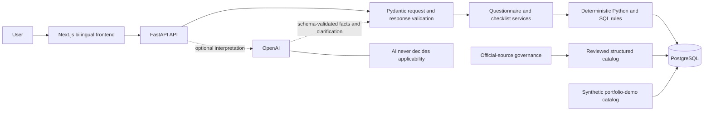
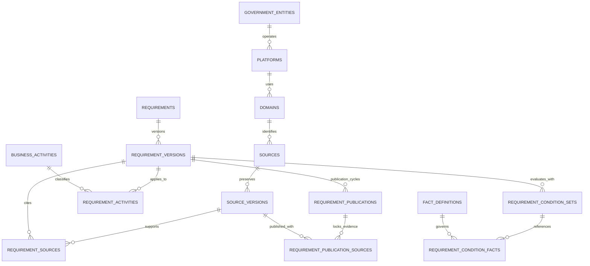

# Architecture

Saudi Business Launch Navigator is an Arabic-first, bilingual web application
that turns structured business answers into an explainable launch checklist.
The public portfolio edition uses fictional data to demonstrate the complete
technical flow without presenting sample content as Saudi regulation.

## System overview

The browser communicates only with FastAPI. It never connects directly to
PostgreSQL or an AI provider. FastAPI validates requests, loads the relevant
catalog records, evaluates structured conditions, and returns a typed response
containing checklist outcomes, applicability reasons, evidence metadata, and
coverage warnings.

## Frontend

The Next.js frontend provides Arabic and English routes, with Arabic as the
default and full right-to-left support. It obtains activities, questionnaire
definitions, and checklist results from the API rather than embedding
regulatory decisions in presentation code.

The interface preserves three distinct answers: Yes, No, and I don't know.
Missing information links back to the relevant question, allowing the user to
complete an answer and submit the questionnaire again.

## API and application services

FastAPI is the public application boundary. It is responsible for:

- validating activity identifiers and questionnaire answers;
- enforcing the active catalog mode;
- loading versioned requirements, conditions, sources, and guidance;
- invoking the deterministic checklist service;
- returning safe, structured errors; and
- exposing separate liveness and database-readiness checks.

Business rules remain separate from HTTP routing. This keeps applicability
behavior testable without a browser and prevents presentation or AI code from
quietly changing a checklist decision.

## API surface

| Method | Path | Responsibility |
| --- | --- | --- |
| `GET` | `/health/live` | Process liveness without a database query |
| `GET` | `/health/ready` | Database and portfolio-catalog readiness |
| `GET` | `/api/v1/activities` | Supported bilingual activity list |
| `POST` | `/api/v1/questionnaire` | Minimum governed questions for one activity |
| `POST` | `/api/v1/checklist` | Deterministic checklist evaluation |
| `POST` | `/api/v1/ai/interpret` | Optional structured text interpretation |
| `POST` | `/api/v1/navigator` | Optional interpretation followed by the authoritative deterministic flow |

The guided activity, questionnaire, and checklist endpoints do not require an
OpenAI key. When optional AI is unavailable, they continue to operate normally.

## Deterministic decision flow

Each conditional requirement references structured facts and versioned
conditions. Evaluation uses three values:

- `true`: the condition is satisfied;
- `false`: the condition is not satisfied; and
- `unknown`: the available answers are not sufficient to decide.

Unknown is never converted to false. The service maps evaluation results to
explicit outcomes such as `APPLIES`, `DOES_NOT_APPLY`, and
`NEEDS_INFORMATION`, and includes the reason for each result. Unconditional
requirements do not create unnecessary questionnaire questions.

## PostgreSQL

PostgreSQL stores stable identities separately from changing versions. The
schema supports requirements, activities, sources, reviewed source versions,
evidence relationships, structured facts, condition sets, and user-facing
guidance. Database constraints protect critical relationships and preserve
historical meaning.

The following diagram highlights the central relationships rather than every
governance or release table:

Alembic manages schema changes. The production-shaped demo initializes from an
empty database, applies the expected migrations, loads the synthetic catalog,
verifies its structure and identity, and then runs the API with a restricted
read-only database role.

## Catalog and demo-data boundary

Catalog selection is explicit and typed:

- `GOVERNED_REAL_CATALOG` represents a reviewed regulatory catalog and remains
  fail closed unless its publication controls permit access.
- `PORTFOLIO_DEMO_CATALOG` serves only the checked-in synthetic catalog used by
  this portfolio demonstration.

The demo database is built independently from migrations and fictional seed
data. Startup verifies the expected database name, schema, catalog identity,
and graph before serving requests. A mismatch stops startup rather than falling
back to unverified content. API metadata and the frontend's compiled catalog
mode must also agree.

Every demo API response carries synthetic-catalog metadata, and the frontend
presents the sample-data boundary visibly. Example source links use reserved
`.invalid` domains internally and must not be interpreted as official evidence.

## Optional OpenAI integration

OpenAI support is deliberately bounded. It may help interpret a user's free
text into supported structured fields or explain an already computed result.
Its output is schema-validated before use.

The model cannot create requirements, select sources, decide applicability, or
replace missing facts. If the integration is unavailable, the guided
questionnaire and deterministic checklist continue to work normally.

## Reliability and security

The application favors fail-closed behavior at trust boundaries:

- invalid catalog identity or configuration prevents startup;
- stale, incomplete, or conflicting information remains visible;
- unknown answers remain unresolved until clarified;
- runtime database access is read-only and narrowly granted;
- CORS and trusted hosts use explicit allowlists;
- browser-facing errors omit credentials and internal database details;
- backend secrets are never exposed through browser-visible configuration; and
- liveness remains independent from database readiness.

Automated unit, integration, database, API, security, and browser tests cover
the decision flow and its negative paths.
